# Frontend Mentor - Testimonials grid section solution

This is a solution to the [Testimonials grid section challenge on Frontend Mentor](https://www.frontendmentor.io/challenges/testimonials-grid-section-Nnw6J7Un7). Frontend Mentor challenges help you improve your coding skills by building realistic projects.

## Table of contents

- [Overview](#overview)
  - [The challenge](#the-challenge)
  - [Screenshot](#screenshot)
  - [Links](#links)
- [My process](#my-process)
  - [Built with](#built-with)
  - [What I learned](#what-i-learned)
  - [Continued development](#continued-development)
  - [Useful resources](#useful-resources)
- [Author](#author)
- [Acknowledgments](#acknowledgments)

## Overview

### The challenge

Users should be able to:

- View the optimal layout for the site depending on their device's screen size

### Screenshot

HTML
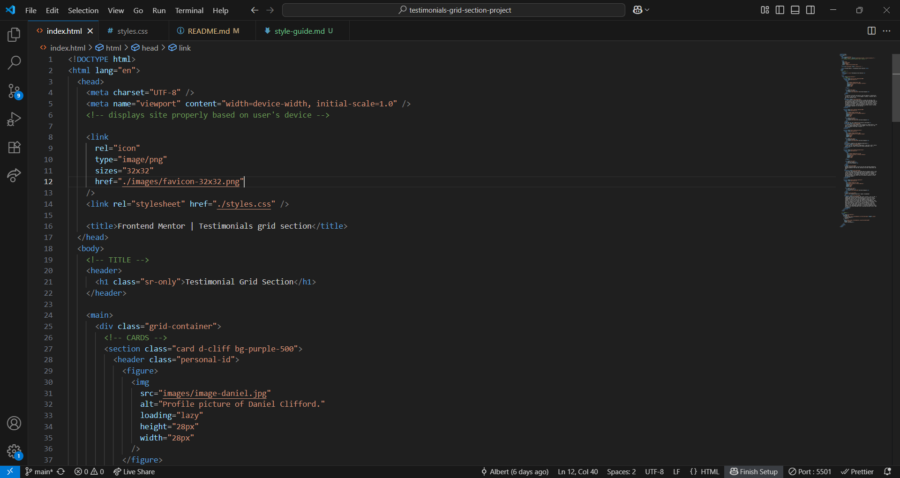
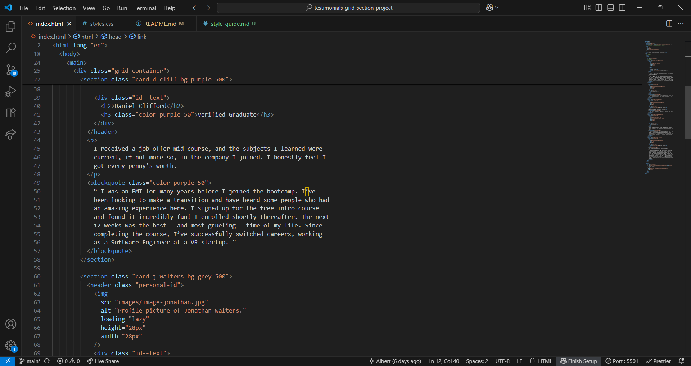
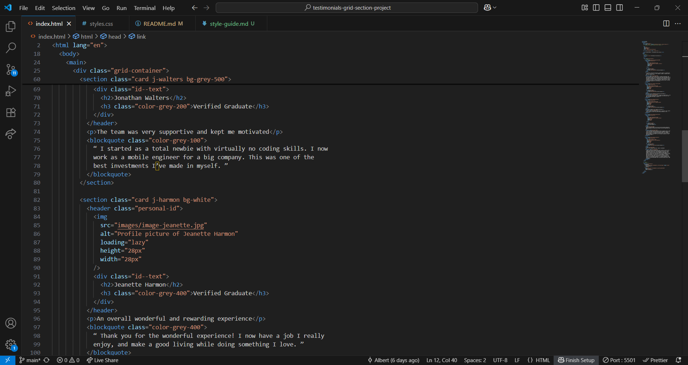
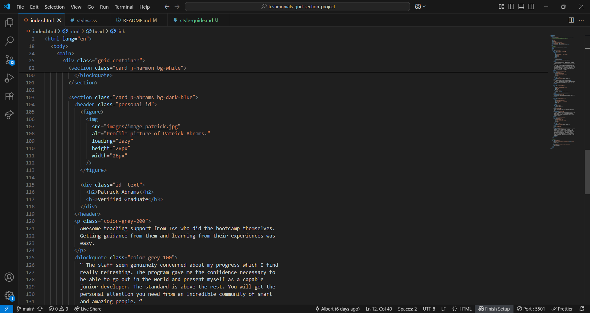
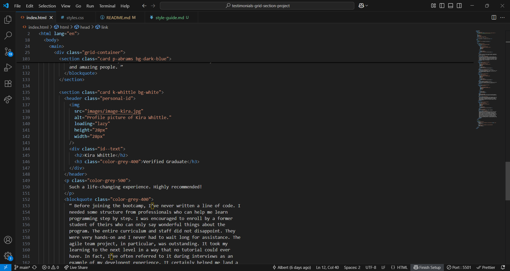
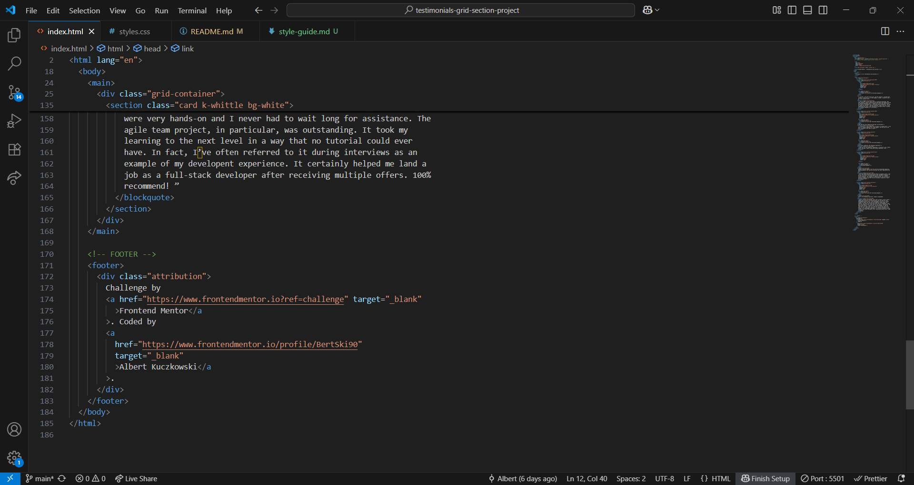

CSS
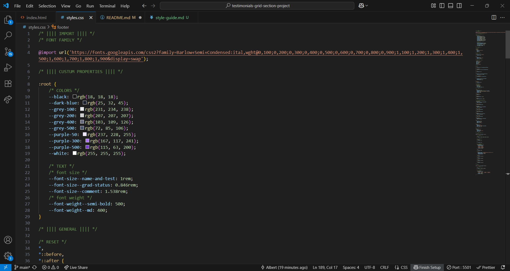
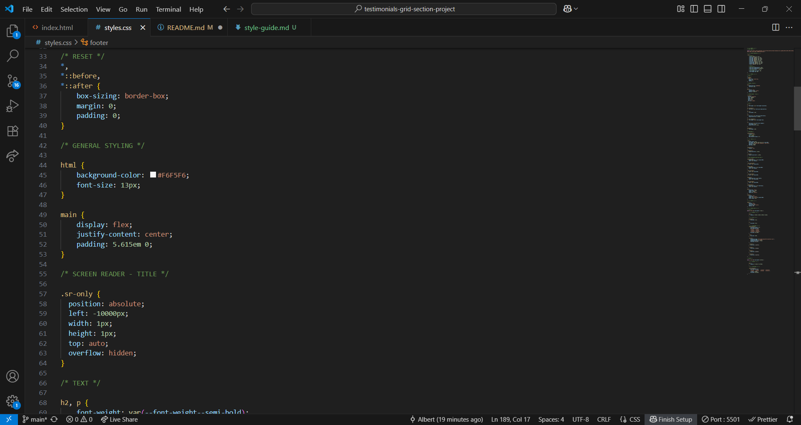
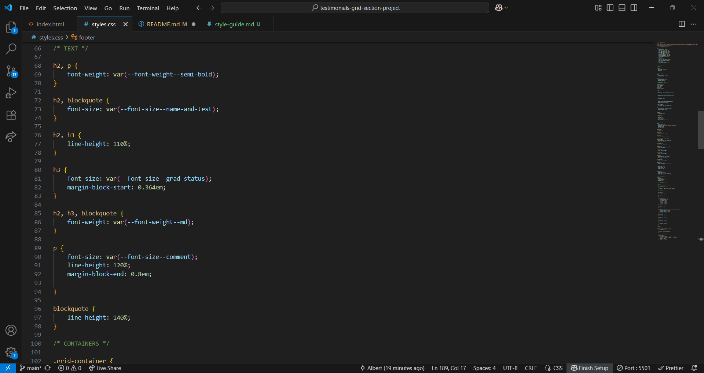
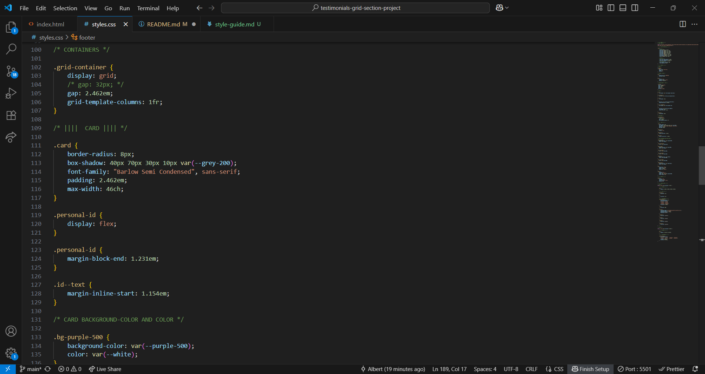
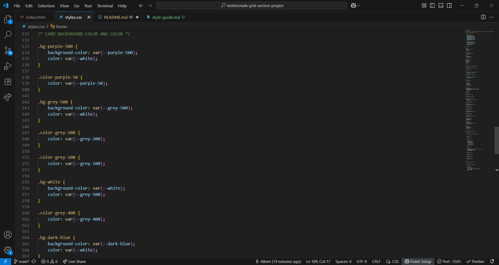
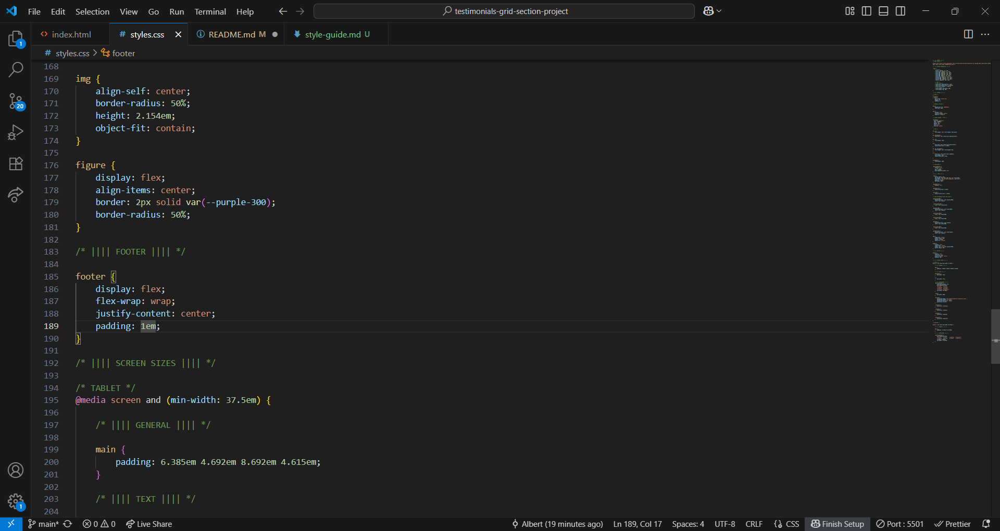
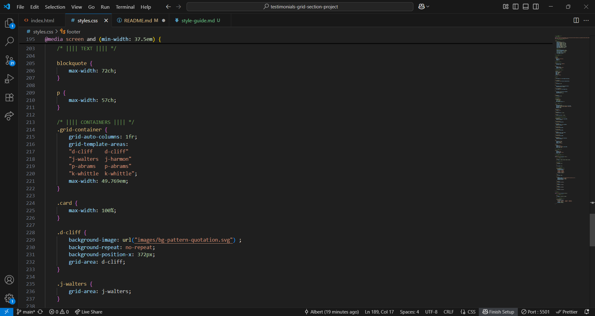
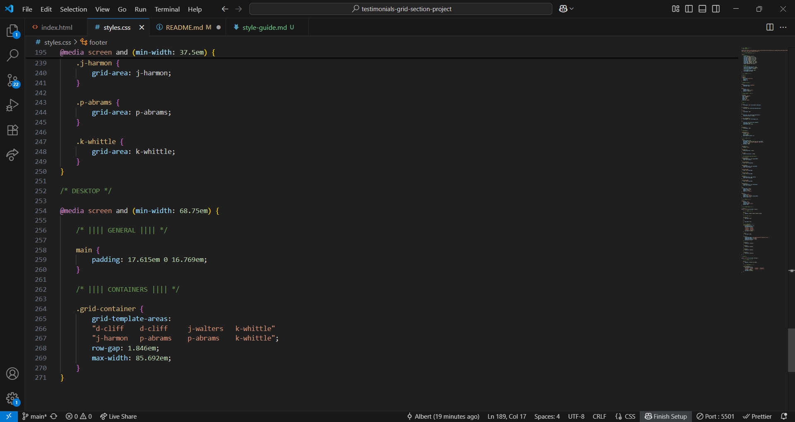

### Links

- Solution URL: [Github @BertSki90](https://github.com/BertSki90/testimonials-grid-section)
- Live Site URL: [Github @BertSki90](https://bertski90.github.io/testimonials-grid-section/)

## My process

### Built with

- Semantic HTML5 markup
- CSS custom properties
- Flexbox
- CSS Grid
- Mobile-first workflow

### What I learned

The cards were not expanding the full length of the grid container making the cards different widths. With "max-width:100%;" the cards expanded across the full width of the cell and/or container. The text did not match the design. To fix this I gave "blockquote" a "max-width:72ch;" to closer match the text in the design file.

See below:

```html
<!-- .card | max-width=100%; -->
<div class="card d-cliff bg-purple-500">
  <div class="personal-id">
    
    <div class="id--text">
      <h1>Daniel Clifford</h1>
      <h2 class="color-purple-50">Verified Graduate</h2>
    </div>
  </div>
  <p>
    I received a job offer mid-course, and the subjects I learned were current,
    if not more so, in the company I joined. I honestly feel I got every penny’s
    worth.
  </p>
  <!-- blockquote | max-width:72ch; -->
  <blockquote class="color-purple-50">
    “ I was an EMT for many years before I joined the bootcamp. I’ve been
    looking to make a transition and have heard some people who had an amazing
    experience here. I signed up for the free intro course and found it
    incredibly fun! I enrolled shortly thereafter. The next 12 weeks was the
    best - and most grueling - time of my life. Since completing the course,
    I’ve successfully switched careers, working as a Software Engineer at a VR
    startup. ”
  </blockquote>
</div>
```

```css
blockquote {
  max-width: 72ch;
}

.card {
  max-width: 100%;
}
```

When putting a border around and image it will shrink the image. I wrapped the images to have borders with the figure element and styled that element with a border. From now on I will be wrapping my images with some sort of element in future projects to allow for more versatile styling. See below:

```html
<section class="card d-cliff bg-purple-500">
  <header class="personal-id">
    <figure>
      
    </figure>

    <div class="id--text">
      <h2>Daniel Clifford</h2>
      <h3 class="color-purple-50">Verified Graduate</h3>
    </div>
  </header>
  <!-- more code -->
</section>
```

```css
img {
  align-self: center;
  border-radius: 50%;
  height: 2.154em;
  object-fit: contain;
}

figure {
  display: flex;
  align-items: center;
  border: 2px solid var(--purple-300);
  border-radius: 50%;
}
```

### Continued development

Completion time: 11hrs

I am enjoying these projects. I want to get better at matching the design files, working with CSS grid and flexbox, and using HTML elements more semantically. I need to train my eye to spot more details ahead of time.

### Useful resources

- [Frontend Mentor](https://www.frontendmentor.io/learning-paths/building-responsive-layouts--z1qCXVqkD) - This helped me be more prepared for this project. The Learning Path is an excellent resource. Thank you.

## Author

- Website - [Github profile @BertSki90](https://github.com/BertSki90)
- Frontend Mentor - [@BertSki90](https://www.frontendmentor.io/profile/BertSki90)
- X - [@BertSki90](https://x.com/BertSki90s)

## Acknowledgments

Thank you to Frontend Mentor and FreeCodeCamp for introducing me to the world of code. I am appreciating every second of it. Thank you!
